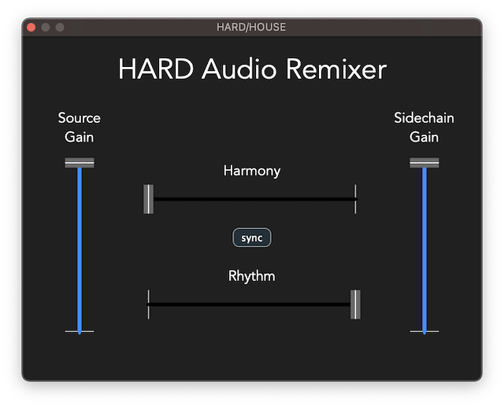

# HARD


**HA**rmony-**R**hythm **D**isentanglement audio remixer plugin.
+ AudioUnit plugin
+ Tested on MacOS with arm64 / x86_64 architecture CPU.

This repository is a submission to the Neural Audio Plugin Competition (https://www.theaudioprogrammer.com/neural-audio).

---------

## How to install
1. Download `HARD-AUplugin.zip` from the releases.
2. Unzip the zip file and copy `HARD.component` to your AU plugin installation path. Typically the installation path is `/Users/[Your Username]/Library/Audio/Plug-Ins/Components/`.

--------

## How to use
***Note: Make sure your DAW is running at sample rate 44.1kHz.*
1. Create two audio tracks in your DAW and load a music audio clip into each track,
2. Synchronize the two audio clips using the audio time-stretching feature in your DAW,
3. Insert the HARD plugin to one of the audio tracks (If "Apple cannot check app for malicious software" notification shows up, manually allow the plugin from System Settings -> Security & Privacy, then restart the DAW)
4. Send the output of the other audio track to the sidechain channel of the HARD plugin,
5. Start playback and enjoy!

-------
You can control audio generation by moving the sliders.

+ Harmony / Rhythm: Adjust how much the generated audio contains the harmonic / rhythmic content of the audio from the source / sidechain channel. Moving the slider to the right side gives more weight to the sidechain channel
+ Synchronise the Harmony and Rhythm slider by toggling the "sync" button
+ Source Gain / Sidechain Gain: Adjust the level of the audio that is input to the neural network model. Use these sliders if there is a large difference in audio level between the source and sidechain inputs

-----

## How to build

This repository contains the entire XCode project. 

1. Clone the repository using the following command:
```
git clone --recursive https://github.com/WuYiming6526/HARD.git
```
2. Download the model file from https://www.dropbox.com/s/ndd7rrrljjccqfh/morpher.onnx?dl=0. Copy the downloaded file `morpher.onnx` to the root directory.
3. Open the XCode project at `Builds/MacOSX/HARD.xcodeproj`
4. Build the project

The built AU plugin file is automatically copied to the AU plugin installation path when the build process is finished.